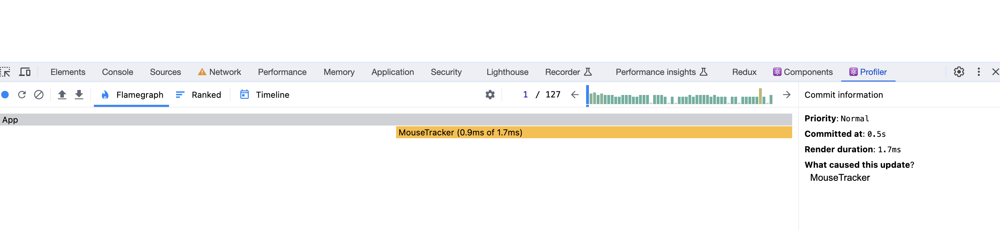
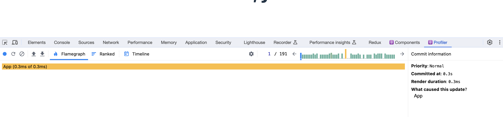

# Advanced React


**All notes are from book [Advanced React](https://advanced-react.com/), I highly recommend to buy it for supporting the author**, and you won't regret it, it's a great book.

## Table of Contents

- [Chapter 1: Intro to re-renders](#intro-to-re-renders)
  - [Re-renders](#re-renders)
  - [The big re-renders myth](#the-big-re-renders-myth)
  - [Moving state down](#moving-state-down)
    [The danger of custom hooks](#the-danger-of-custom-hooks)
- [Chapter 2: Elements, children as props and re-renders](#chapter-2-elements-children-as-props-and-re-renders)
  - [What is a component?](#what-is-a-component)
  - [What is an element?](#what-is-an-element)
  - [What is re-render?](#what-is-re-render)
    - [Fiber Tree](#fiber-tree)
    - [Virtual DOM](#virtual-dom)
    - [Diffing](#diffing)
  - [Children as props](#children-as-props)
- [Chapter 3: Configuration concerns with elements as props](#chapter-3-configuration-concerns-with-elements-as-props)
  - [Elements as props](#elements-as-props)
  - [children as props](#children-as-props)
  - [What is the main difference between children and element as props?](#what-is-the-main-difference-between-children-and-element-as-props)
  - [What is ReactNode and ReactElement?](#what-is-reactnode-and-reactelement)
- [Chapter 4: Advanced configuration with render props](#chapter-4-advanced-configuration-with-render-props)
  - [Render props for rendering Elements](#render-props-for-rendering-elements)
    - [What is render props?](#what-is-render-props)
    - [Sharing stateful logic: children as render props](#sharing-stateful-logic-children-as-render-props)
    - [Hooks replaced render props](#hooks-replaced-render-props)
    - [Render props vs Hooks](#render-props-vs-hooks)
- [Chapter 5: Memoization with useMemo, useCallback and React.memo](#chapter-5-memoization-with-usememo-usecallback-and-reactmemo)
  - [Refresh: How does javascript compare values?](#refresh-how-does-javascript-compare-values)
    - [Primitive values](#primitive-values)
    - [Reference values](#reference-values)
  - [What is memoization?](#what-is-memoization)
  - [Memoization in React](#memoization-in-react)
  - [useCallback and how to memoize functions](#usecalback-and-how-to-memoize-functions)
  - [useMemo and how to memoize values](#usememo-and-how-to-memoize-values)
  - [What is React.memo?](#what-is-reactmemo)
    - [What is shallow equality?](#what-is-shallow-equality)
    - [What is deep equality?](#what-is-deep-equality)
  - [Three rules of using React.Memo](#three-rules-of-using-react-memo)
  - [React.Memo and children](#react-memo-and-children)

<a id="intro-to-re-renders"></a>

## Chapter 1: Intro to re-renders

## State updates, nested components, and re-renders

- **Mounting**
  - React creates its component's instance for the first time, initialize its state, runs its hooks and appends elements to the DOM.
- **Unmounting**
  - React detects that a component is no longer needed, it does the final clean-up, destroy its instance and everything associated with it.
- **Re-rendering**
  - React updates an already existing component with some new information.

<a id="re-renders"></a>

### Re-rendering

- React **never goes up** the render tree when it re-renders component.

  - If a state updates somewhere in the middle, only the components **down** the tree will re-redner.

- The only way for a component **at the bottom** to affect top component is:
  - **Call state update at the top component.**
  - **Pass components as functions.**

<a id="the-big-re-renders-myth"></a>

## The big re-renders myth

**Component re-renders when its props changes**, but we need to define **props** here more specifically.

We should say **component re-renders when its state props changes**.

For example:

```javascript
import { ModalDialog } from "./components/basic-modal-dialog";
import { Button } from "./components/button";
import "./styles.scss";

export default function App() {
  // local variable won't work
  let isOpen = false;

  return (
    <div className="layout">
      {/* nothing will happen */}
      <Button onClick={() => (isOpen = true)}>Open dialog</Button>
      {/* will never show up */}
      {isOpen ? <ModalDialog onClose={() => (isOpen = false)} /> : null}
    </div>
  );
}
```

Now, let's use state variables here, and once I changed local variable to state variable, I was able to click the button and showed dialog.

```javascript
import { useState } from "react";
import { ModalDialog } from "./components/basic-modal-dialog";
import { Button } from "./components/button";
import "./styles.scss";

export default function App() {
  const [isOpen, setIsOpen] = useState(false);

  return (
    <div className="layout">
      <Button onClick={() => setIsOpen(true)}>Open dialog</Button>
      {isOpen ? <ModalDialog onClose={() => setIsOpen(false)} /> : null}
    </div>
  );
}
```

> [Example from Advanced React](https://advanced-react.com/examples/01/02)

<a id="moving-state-down"></a>

## Moving state down

In previous example, we used `useState` to control modal open functionality, but let's dive more into it, let's say we have other components below it, are they going to re-render?

```javascript
export default function App() {
  const [isOpen, setIsOpen] = useState(false);

  return (
    <div className="layout">
      <Button onClick={() => setIsOpen(true)}>Open dialog</Button>

      {isOpen ? <ModalDialog onClose={() => setIsOpen(false)} /> : null}
      <OtherComponent1 />
      <OtherComponent2 />
      <OtherComponent3 />
    </div>
  );
}
```

The answer is **YES**, then here come the questions.

### Question 1: Do we need them to re-render?

No. We do not need those components that are not related to dialog to re-render.

### Question 2: How can we prevent **unnecessary re-render?**

- Approach 1: Use `useMemo`(We are not going to use here.)
- Approach 2: Extract component that depends on that state and the state itself into smaller component.

```javascript
export const ActionButtonOfModalDialog = () => {
  const [isOpen, setIsOpen] = useState(false);

  return (
    <>
      <Button onClick={() => setIsOpen(true)}>Open dialog</Button>

      {isOpen ? <ModalDialog onClose={() => setIsOpen(false)} /> : null}
    </>
  );
};
```

```javascript
export default function App() {
  return (
    <div className="layout">
      <ActionButtonOfModalDialog />
      <OtherComponent1 />
      <OtherComponent2 />
      <OtherComponent3 />
    </div>
  );
}
```

<a id="the-danger-of-custom-hooks"></a>

## The danger of custom hooks

Sometimes we want to create our custom hooks to make our code more cleaner.

If we extract state into a custom hook as it controls the open, close and check isOpen functionality.

```javascript
// useModalDialog

export const useModalDialog = () => {
    const [isOpen, setIsOpen] = useState(false);
    return {
        isOpen,
        open:() => setIsOpen(true)
        close:() => setIsOpen(false)
    }
}
```

And we apply to the `App`

```javascript
export default function App() {
  const { isOpen, open, close } = useModalDialog();

  return (
    <div className="layout">
      <Button onClick={open}>Open dialog</Button>
      {isOpen ? <ModalDialog onClose={close} /> : null}
      <OtherComponent1 />
      <OtherComponent2 />
      <OtherComponent3 />
    </div>
  );
}
```

### Question: Would custom hook trigger re-render?

**Yes**, it still triggers re-render, eventhough we just extract them and create a custom hook, the state is still inside of `App`.

### Question: How to fix it?

We can use our custom hook inside the `ActionButtonOfModalDialog` as we make the state lives in the component.

```javascript
export const ActionButtonOfModalDialog = () => {
  const { isOpen, open, close } = useModalDialog();

  return (
    <>
      <Button onClick={open}>Open dialog</Button>

      {isOpen ? <ModalDialog onClose={close} /> : null}
    </>
  );
};
```

<a id="chapter-2-elements-children-as-props-and-re-renders"></a>

## Chapter 2: Elements, children as props and re-renders.

## Elements, Components and re-renders

<a id="what-is-a-component"></a>

### What is a component?

- A component is a function which returns elements and React converts into DOM elements.
- We can see a prop is the first argument of the component.

```javascript
const Parent = (props) => {
  return <Child />;
};
```

<a id="what-is-an-element"></a>

### What is an element?

- An element is an **object** that defines a component that needs to be rendered on the screen.
- Element could be just a normal **DOM elements**, like the example below `<Greeting/>` returns `<h1>` arrtibute.
- JSX is syntax sugar for the `React.createElement` function.

For example:

```javascript
// With JSX

const Greeting = ({name}) => {
    return (
      <h1>Hello <i>{name}</i> </h1>
    );
}

export defualt function App() {
    return <Greeting name={Alen}/>
}
```

```javascript
// Without JSX

const Greeting = ({ name }) => {
  return createElement("h1", "Hello ", createElement("i", null, name));
};

export default function App() {
  return createElenment(Greeting, { name: "Alen" });
}
```

Below are explanations from React official doc.

- **createElement** returns a React element object with a few properties:
- **type:** The type you have passed.
- **props:** The props you have passed except for `ref` and `key`. If the type is a component with legacy `type.defaultProps`, then any missing or undefined `props` will get the values from `type.defaultProps`.
- **ref:** The `ref` you have passed. If missing, `null`.
- **key:** The key you have passed, coerced to a string. If missing, `null`.

[React Official Doc: createElement](https://react.dev/reference/react/createElement#creating-an-element-without-jsx)

<a id="what-is-re-render"></a>

### What is re-render

- React calls functions and executes everything that needs to be executed in the process, from the return of functions, React builds a tree of those objects.
- Here we needs to understand several important concepts:

<a id="fiber-tree"></a>

#### Fiber Tree

- A Fiber is a JavaScript object that contains information about a component, its input, and its output.
- It represents a unit of work in React's rendering process.
- Each component in a React application has a corresponding Fiber.
- How does fiber tree work?
  - **Breaking Down Work:**
    - breaks down this big list into smaller tasks. Each Fiber represents one of these tasks.
  - **Incremental Rendering:**
    - Works on a few tasks, then pause and check if there's something more urgent to handle (like user interactions), and then resume the rendering tasks.
  - **Structure:**
    - The Fiber Tree has a root and branches. Each Fiber links to its parent, its siblings, and its child, it includes additional technical details needed for React's internal processes.
  - **Reconciliation:**
    - When **state or props of a component change**, React creates new Fibers and compares them with the existing ones.

<a id="virtual-dom"></a>

#### Virtual DOM

The Virtual DOM is a **lightweight copy** or representation of the actual Document Object Model (DOM) of a webpage.

<a id="diffing"></a>

#### Diffing

- **"Diffing"** in the context of web development, especially with frameworks like React, refers to the process of **comparing two virtual DOM trees to identify what has changed**.
- The Concept of Diffing:
  - **Two Virtual DOM Trees:**
    - Two versions of the Virtual DOM: one represents the **current state of the UI**, and the other represents the **new state after some changes** (like user interactions or data updates).
  - **Identifying Changes:**
    - Figuring out which components in the virtual DOM have changed, been added, or removed.
  - **Efficient Comparison:**
    - If the type of an element has changed, it will rebuild the whole subtree to avoid complex calculations.
  - **Minimizing Real DOM Manipulation:**
    - To minimize the updates that need to be made to the actual DOM, which is a costly operation in terms of performance.

---

Now let's use an example and explain be bit more.

```javascript
const MovingBlock = ({ position }: { position: number }) => (
  <div className="movable-block" style={{ top: position }}>
    {position}
  </div>
);

const getPosition = (val: number) => 150 - val / 2;

export default function App() {
  const [position, setPosition] = useState(150);

  const onScroll = (e: any) => {
    // calculate position based on the scrolled value
    const calculated = getPosition(e.target.scrollTop);
    // save it to state
    setPosition(calculated);
  };

  return (
    <div className="scrollable-block" onScroll={onScroll}>
      {/* pass position value to the new movable component */}
      <MovingBlock position={position} />
      <VerySlowComponent />
      <BunchOfStuff />
      <OtherStuffAlsoComplicated />
    </div>
  );
}
```

In example above, when state has changed, all components are going to re-render, how can we prevent unnecessary re-render?

- Step 1: Extract irrelevant components and store as a variable.
- Step 2: Create another component and move state management and relevant component inside of it.
- Step 3: Pass the variable that store all irrelevant components as props.

```javascript
const MovingBlock = ({ position }) => (
  <div className="movable-block" style={{ top: position }}>
    {position}
  </div>
);

const getPosition = (val) => 150 - val / 2;

const ScrollableWithMovingBlock = ({ content }) => {
  const [position, setPosition] = useState(150);

  const onScroll = (e: any) => {
    const calculated = getPosition(e.target.scrollTop);
    setPosition(calculated);
  };

  return (
    <div className="scrollable-block" onScroll={onScroll}>
      <MovingBlock position={position} />
      {content}
    </div>
  );
};

export default function App() {
  const otherComponents = (
    <>
      <VerySlowComponent />
      <BunchOfStuff />
      <OtherStuffAlsoComplicated />
    </>
  );

  return <ScrollableWithMovingBlock content={otherComponents} />;
}
```

Why this does not trigger re-render?

When `setPosition` is triggered, React will compare all object definations that the function returns, meaning that React will check if `content` object is the same as before and after,in this example, only `<MovingBlock position={position}/>` will re-render.

---

<a id="children-as-props"></a>

### Children as props

Props are an object that we pass as the first argument to the component function, **children** are props and behave like any other prop when they are passed via `JSX` nesting syntax.

From code above, we can leverage JSX syntax to something like this.

```javascript
const MovingBlock = ({ position }) => (
  <div className="movable-block" style={{ top: position }}>
    {position}
  </div>
);

const getPosition = (val) => 150 - val / 2;

const ScrollableWithMovingBlock = ({ children }) => {
  const [position, setPosition] = useState(150);

  const onScroll = (e: any) => {
    const calculated = getPosition(e.target.scrollTop);
    setPosition(calculated);
  };

  return (
    <div className="scrollable-block" onScroll={onScroll}>
      <MovingBlock position={position} />
      {children}
    </div>
  );
};

export default function App() {
  return (
    <ScrollableWithMovingBlock>
      <VerySlowComponent />
      <BunchOfStuff />
      <OtherStuffAlsoComplicated />
    </ScrollableWithMovingBlock>
  );
}
```

<a id="chapter-3-configuration-concerns-with-elements-as-props"></a>

# Chapter 3: Configuration concerns with elements as props

<a id="elements-as-props"></a>

## Elements as props

Passing elements as props would help to solve the problem such like when there’s a component, like `<Button/>`, and it has to render icons based on different situation like below, and often it ends up that `<Button/>` components has to receive lot of props, and this is hard to maintain and debug.

```javascript
const Button = ({
    isLoading,
    iconColor,
    iconSize,
    ...
}) => {

}
```

What we can improve is that we pass elements as props, let’s say you need to implement a `<Button/>` component with different icons: `error` and `warning`.

```javascript
// element as props
// Import error and warning icon, here I am using react-icons

import { ReactElement } from "react";
import { MdErrorOutline, MdOutlineWarning } from "react-icons/md";

// Define types of icon
interface IconType {
    color:string;
    size?:"large" | "medium" | "small";
}

//Create error and warning elements
const Error = ({ color, size }: IconType) => (
  <MdErrorOutline style={{ color }} fontSize={size} />
);
const Warning = ({ color, size }: IconType) => (
  <MdOutlineWarning style={{ color }} fontSize={size} />
);

const Button = ({icon}:{icon:ReactElement}) => {
    rerurn <button>Submit {icon}</button>
}

export default function App() {
    return (
      <div>
        <Button icon={<Error color="orange"/>}/>
        <Button icon={<Warning color="red"/>}/>
      </div>
    )
}
```

<a id="children-as-props"></a>

## children as props

```javascript
import "./styles.css";
import { ReactElement, ReactNode } from "react";
import { MdErrorOutline, MdOutlineWarning } from "react-icons/md";

interface IconType {
  color: string;
  size?: "large" | "medium" | "small";
}

const Error = ({ color, size }: IconType) => (
  <MdErrorOutline style={{ color }} fontSize={size} />
);
const Warning = ({ color, size }: IconType) => (
  <MdOutlineWarning style={{ color }} fontSize={size} />
);

const Button = ({ children }: { children: ReactNode }) => {
  return <button>{children}</button>;
};

export default function App() {
  return (
    <div className="App">
      <Button>
        Submit <Error color="orange" />
      </Button>
      <Button>
        Submit <Warning color="red" />
      </Button>
    </div>
  );
}
```

<a id="what-is-the-main-difference-between-children-and-element-as-props"></a>

### What is the main difference between `children` and `element` as props?

- **Passing an element as a prop**:
  - Usage: Define a prop in component, or we can say declare a variable.
    ```javascript
    const Error = () => <MdErrorOutline />;
    ```
  - Example:
    ```javascript
    <Button icon={<Error />} />
    ```
- **Passing children as a prop**:

  - Usage: Use `children` as a prop and placing between the opening and closing tags of the component.
    ```javascript
    const Button = ({ children }) => <button>{children}</button>;
    ```
  - Example:

    ```javascript
    <Button>
      <Error />
    </Button>
    ```

- **Key difference:**
  - **Explicitness:** Passing an element as a specific prop is more explicit and can be more descriptive about the role of the element in the component.
  - **Flexibility in Structure:** Passing children is more flexible for components that _might not know or care about the specific structure or type of their content_.
  - **Complexity and Control:** Passing elements as props can offer more control over how and where each piece of content is rendered within the component, but can also make the component more complex.
  - **Readability:** Using children can sometimes make components easier to read and use, as it adheres to the familiar pattern of HTML structure.

<a id="what-is-reactnode-and-reactelement"></a>

## What is ReactNode and ReactElement?

- **ReactNode:** ReactNode is a type that can be a React element, a React fragment, a string, a number, null, or undefined.
- **ReactElement:** ReactElement is a type that can be a React element, a React fragment, or a React portal.

```javascript
type ReactText = string | number;
type ReactChild = ReactElement | ReactText;

interface ReactNodeArray extends Array<ReactNode> {}
type ReactFragment = {} | ReactNodeArray;
type ReactNode =
  | ReactChild
  | ReactFragment
  | ReactPortal
  | boolean
  | null
  | undefined;
```

Essentially, `ReactNode` is a union type of `ReactChild`, `ReactFragment`, `ReactPortal`, `boolean`, `null`, and `undefined`, and `ReactElement` is just a type alias of `ReactChild`.

<a id="conditional-rendering-and-performance"></a>

## Conditional rendering and performance

```javascript
export default function App() {
  const [isOpen, setIsOpen] = useState(false);

  // Here, <Footer/> is an object, it won't trigger re-render of <App/>
  // Only if isOpen set to true, <Footer/> will be rendered inside of <ModalDialog/>
  const footer = <Footer />;

  return (
    <div className="layout">
      <Button onClick={() => setIsOpen(true)}>Open dialog</Button>
      {isOpen ? (
        <ModalDialog onClose={() => setIsOpen(false)} footer={footer} />
      ) : null}
    </div>
  );
}
```

Here, we declared `<Footer/>` as a variable, which means it is an element, and it's just an **object**, from React's perspective, creating an object is cheap compared to rendering components.

In this case, `<Footer/>` will be re-rendered inside of `<ModalDialog/>` component, but it won't trigger re-render of `<App/>` component since it's just an object.

You might see this kind of pattern in some libraries, like `react-router-dom`, they use this pattern to improve performance, for example:

```javascript
import { BrowserRouter as Router, Route, Switch } from "react-router-dom";

export default function App() {
  return (
    <>
      <Route path="/home" element={<Home />} />
      <Route path="/about" element={<About />} />
    </>
  );
}
```

<a id="chapter-4-advanced-configuration-with-render-props"></a>

## Chapter 4: Advanced configuration with render props

## Render props for rendering Elements

I've used **elements as props** to render elements by assuming that the component will always render the same element, but what if for example the icon library we've used does not have the properties we need. like `color` or `size`, so here we can use **render props** to solve this problem.

### What is render props?

- Render props is a technique for sharing code between React components using a prop whose value is a **function**.

```javascript
// MouseTracker.tsx

import { React, useState, useEffect } from "react";

interface MousePositionProps {
  children: (state: { x: number, y: number }) => JSX.Element;
}

export const MouseTracker: React.FC<MousePositionProps> = ({ children }) => {
  const [position, setPosition] = useState({ x: 0, y: 0 });

  useEffect(() => {
    const updateMousePosition = (e: MouseEvent) => {
      setPosition({ x: e.clientX, y: e.clientY });
    };

    document.addEventListener("mousemove", updateMousePosition);

    return () => {
      document.removeEventListener("mousemove", updateMousePosition);
    };
  }, []);

  return children(position);
};
```

```javascript
// App.tsx

import { MouseTracker } from "./MouseTracker";

export default function App() {
  return (
    <div>
      <MouseTracker>
        {({ x, y }) => (
          <h1>
            Mouse at position:
            <br /> x: {x}, y: {y}
          </h1>
        )}
      </MouseTracker>
    </div>
  );
}
```

<a id="sharing-stateful-logic-children-as-render-props"></a>

### Sharing stateful logic: children as render props

```javascript
// MouseTracker.tsx

import { React, useState, useEffect } from "react";

interface MousePositionProps {
  renderMousePosition: (state: { x: number, y: number }) => JSX.Element;
}

export const MouseTracker: React.FC<MousePositionProps> = ({
  renderMousePosition,
}) => {
  const [position, setPosition] = useState({ x: 0, y: 0 });

  useEffect(() => {
    const updateMousePosition = (e: MouseEvent) => {
      setPosition({ x: e.clientX, y: e.clientY });
    };

    document.addEventListener("mousemove", updateMousePosition);

    return () => {
      document.removeEventListener("mousemove", updateMousePosition);
    };
  }, []);

  return renderMousePosition(position);
};
```

```javascript
// App.tsx
import { MouseTracker } from "./MouseTracker";

export default function App() {
  return (
    <div>
      <MouseTracker
        renderMousePosition={({ x, y }) => (
          <h1>
            Mouse at position:
            <br /> x: {x}, y: {y}
          </h1>
        )}
      />
    </div>
  );
}
```

<a id="sharing-stateful-logic-custom-hooks"></a>

### Hooks replaced render props

We can extract the logic from `MouseTracker` component and create a custom hook, and use it inside of `App` component, this approach has the same effect as render props.

```javascript
// useMousePosition.tsx

import { useState, useEffect } from "react";

export const useMousePosition = () => {
  const [position, setPosition] = useState({ x: 0, y: 0 });

  useEffect(() => {
    const updateMousePosition = (e: MouseEvent) => {
      setPosition({ x: e.clientX, y: e.clientY });
    };

    document.addEventListener("mousemove", updateMousePosition);

    return () => {
      document.removeEventListener("mousemove", updateMousePosition);
    };
  }, []);

  return position;
};
```

```javascript
// App.tsx

import { useMousePosition } from "./useMousePosition";

export default function App() {
  const { x, y } = useMousePosition();

  return (
    <div>
      <h1>
        Mouse at position:
        <br /> x: {x}, y: {y}
      </h1>
    </div>
  );
}
```

<a id="render-props-vs-hooks"></a>

### Render props vs Hooks

Let's use **profiler** to check what causes re-render.

- render props
  

  Only `MouseTracker` causes re-render.

- hooks
  
  `App` causes re-render.

<a id="memoization-with-usememo-usecallback-and-reactmemo"></a>

## Chapter 5: Memoization with useMemo, useCallback and React.memo

Before we jump into `useMemo`, `useCallback` and `React.memo`, we need to understand what is **memoization** and some basic of javascript.

<a id="how-does-javascript-compare-values"></a>

### Refresh: How does javascript compare values?

First we need to refresh our memory about how javascript compare values, there are two types of values in javascript, **primitive** values and **reference** values.

<a id="primitive-values"></a>

#### Primitive values:

- **Primitive values:**
  - `string`
  - `number`
  - `boolean`
  - `null`
  - `undefined`
  - `symbol`
  - `bigint`
- Characteristics of Primitive Values:

  - **Immutable:** Primitive values are immutable, meaning that they cannot be changed.
  - **Compared by Value:** Primitive values are compared by value, meaning that two values are strictly equal if they have the same value.
  - **Copy by value:** When we assign a primitive value to a variable, the value is copied to the variable.

- Example 1:

  ```javascript
  let a = 1;
  let b = a; // copy by value
  a = 2; // Changing a does not affect b
  console.log(b); // 1
  ```

- Example 2:

  ```javascript
  let a = "hello";
  let b = a; // copy by value
  a = "world"; // Changing a does not affect b
  console.log(b); // hello
  ```

<a id="reference-values"></a>

#### Reference values:

- **Reference values:**

  - `object`
  - `array`
  - `function`

- Characteristics of Reference Values:

  - **Mutable:** Reference values are mutable, meaning that they can be changed.
  - **Compared by Reference:** Reference values are compared by reference, meaning that two values are strictly equal if they refer to the same object.
  - **Copy by reference:** When we assign a reference value to a variable, the reference is copied to the variable.

- Example 1:

  ```javascript
  let a = { name: "Alen" };
  let b = a; // copy by reference
  a.name = "Bob"; // Changing a affects b
  console.log(b.name); // Bob
  ```

- Example 2:

  ```javascript
  let a = [1, 2, 3];
  let b = a; // copy by reference
  a.push(4); // Changing a affects b
  console.log(b); // [1, 2, 3, 4]
  ```

- Example 3:

  ```javascript
  const a = { a: 1 };
  const b = { a: 1 };
  console.log(a === b); // false, because they are different instances in memory.
  ```

- Example 4:

  ```javascript
  const a = { a: 1 };
  const b = a;
  console.log(a === b); // true, because they are compared by reference, and they have same reference in memory.
  ```

<a id="what-is-memoization"></a>

### What is memoization?

It is an optimization technique, it does this by storing computation results in cache, and retrieving them from cache when needed.

- **Cache storage:** Memoization involves maintaining a cache (like a table or dictionary) where the results of function calls are stored. Each entry in the cache corresponds to a set of input parameters of the function.

- **Function modification:** When the memoized function is called, it first checks if the result for the given set of inputs is already in the cache.
  - If it is, then the cached result is returned.
  - If it is not, then the function is executed and the result is stored in the cache.-

### Memoization in React

When React re-renders a component, it needs to compare the previous and the new values of the props and state to determine if the component needs to be re-rendered, i.e. when we use `useEffect` hook, React will compare the previous and the new values of the dependencies.

```javascript
export const Component = () => {
  const submit = () => {
    // submit logic
  };

  useEffect(() => {
    // do something
  }, [submit]);

  return <button onClick={submit}>Submit</button>;
};
```

In this example, React will compare the previous and the new values of `submit` function, and it will always be different, because `submit` function is created every time the component re-renders, and remember that **functions are reference values**, so React will compare the reference of the function, and it will always be different.

<a id="usecalback-and-how-to-memoize-functions"></a>

### `useCallback` and how to memoize functions

1. We can use `useCallback` to **cache a function** between re-renders by doing `const cachedFn = useCallback(fn, dependencies)`
2. Call `useCallback` at the top level of the component.

- ## **Usage**:

  - **Skipping re-rendering of components:** React will compare the **dependencies** with the previous dependencies, and compare with `Object.is`, if none of the dependencies changed, React will skip re-rendering of the component.

  ```javascript
  export const Component = () => {
    const submit = useCallback(() => {
      // submit logic
    }, []);

    useEffect(() => {
      // do something
    }, [submit]);

    return <button onClick={submit}>Submit</button>;
  };
  ```

- **Updating state from a memoized callback:** This is when we need to update state based on previous state from a memoized callback, we need to use the callback version of `setState` to make sure that we are using the latest state.

  ```javascript
  export const Component = () => {
    const [todos, setTodos] = useState([]);

    const handleAddTodo = useCallback((text) => {
      const newTodo = {id: nextId++, text};
      setTodos([...todos, newTodo]);
    },[todos])
  ```

  When we need to read some state **only to calculate the next state**, we can remove that `todos` dependency by passing an [update function](https://react.dev/reference/react/useState#updating-state-based-on-the-previous-state).

  ```javascript
  export const Component = () => {
    const [todos, setTodos] = useState([]);

    const handleAddTodo = useCallback((text) => {
      const newTodo = {id: nextId++, text};
      setTodos(todos => [...todos, newTodo]);
    },[])
  ```

  - **Preventing an Effect from firing too often:** This is when we need to call a function inside an [Effect](https://react.dev/learn/synchronizing-with-effects).

  ```javascript
  export const FetchData = () => {
    const [query, setQuery] = useState("");

    const buildQuery = useCallback(() => {
      // build query
    }, [query]); // Only change when query changes

    useEffect(() => {
      const url = buildQuery();
      // fetch data
    }, [buildQuery]); // Only change when buildQuery changes
  };
  ```

  - **Optimizing a custom Hook:** When create a custom hook, React official recommends to use `useCallback` wrap any function.

> Reference: [React Official Doc: useCallback](https://react.dev/docs/hooks-reference#usecallback)

<a id="usememo-and-how-to-memoize-values"></a>

### `useMemo` and how to memoize values

1. We can use `useMemo` to **cache a value** between re-renders by doing `const cachedValue = useMemo(calculateValue, dependencies)`
2. Call `useMemo` at the top level of the component to cache a calculation between re-renders.
3. On the initial render, `useMemo` returns the result of calling calculateValue with no arguments, and during next renders, it will only recompute the cached value when one of the dependencies has changed.

- ## **Usage**:

  - **Skipping expensive recalculations:** See the explanation on point 3 above.
    - [Example from React doc](https://react.dev/reference/react/useMemo#skipping-expensive-recalculations)
  - **Skipping re-rendering of components:**
    - [Example from React doc](https://react.dev/reference/react/useMemo#skipping-repeated-calculations)]
  - **Memoizing a dependency of another Hook:**
    - [Example from React doc](https://react.dev/reference/react/useMemo#memoizing-a-dependency-of-another-hook)
  - **Memoizing a function:**
    - [Example from React doc](https://react.dev/reference/react/useMemo#memoizing-a-function)

### Anti-pattern: memoizing props

See example here, it seemed to be preventing re-render, but it's not, because when a component re-renders, every component inside of it will re-render.

```javascript
const Component = () => {
  const handleClick = useCallback(() => {
    // do something
  }, []);

  return <Button onClick={handleClick} />;
};
```

#### Two major cases where we should memoize props:

- **When the prop is used as a dependency in another hook:**

  ```javascript
  const FetchProduct = () => {
    const fetch = useCallback(() => {
      // fetch data
    }, [productId]);

    return <ProductListing onFetch={fetch} />;
  };

  const ProductListing = ({ onFetch }) => {
    useEffect(() => {
      onFetch();
    }, [onFetch]);
  };
  ```

- **When a component is wrapped in `React.memo`**

<a id="what-is-reactmemo"></a>

### What is `React.memo`

`memo `lets you skip re-rendering a component when its props are unchanged. By using `const MemoizedComponent = memo(SomeComponent, arePropsEqual?)`

- **component:** The `memo` does not modify it, but to return a new, memoized component.
- **arePropsEqual:** This is an optional, a function can accepts 2 arguments: `prevProps` and `nextProps`, and returns a boolean value, if `true`, the component will not re-render.

- **Usage:**
  - **Skipping re-rendering of components:**
    - [Example from React doc](https://react.dev/reference/react/memo#skipping-re-rendering-when-props-are-unchanged)
  - **Updating a memoized component using state:**
    - [Example from React doc](https://react.dev/reference/react/memo#updating-a-memoized-component-using-state)
    - Even if we use `memo` to wrap a component, it will still re-render if the state changes.
  - **Minimizing props changes:**
    - [Example from React doc](https://react.dev/reference/react/memo#minimizing-props-changes)
    - If any prop is **not shallowly equal**, the component will re-render.
    - If we want to prevent re-rendering, we need to use `useMemo` to wrap the prop, especially when the prop is an object or an array.
  - **Specifying a custom comparison function:**
    - [Example from React doc](https://react.dev/reference/react/memo#specifying-a-custom-comparison-function)

<a id="what-is-shallow-equality"></a>

#### What is shallow equality?

This is a method of comparison between two objects or arrays that checks for equality only **at the first level of their properties or elements.**

```javascript
const obj1 = { a: 1, b: 2 };
const obj2 = { a: 1, b: 2 };

// Key-value pairs are the same
```

```javascript
const arr1 = [1, 2, 3];
const arr2 = [1, 2, 3];
```

<a id="what-is-deep-equality"></a>

#### What is deep equality?

Unlike shallow equality, deep equality checks for equality **at all levels of the object or array.**

```javascript
const obj1 = { a: 1, b: { c: 2 } };
const obj2 = { a: 1, b: { c: 2 } };
```

```javascript
const arr1 = [1, 2, [3, 4]];
const arr2 = [1, 2, [3, 4]];
```

<a id="three-rules-of-using-react-memo"></a>

### Three rules of using `React.memo`

- **Rule 1: never spread props that are coming from other components**
  spreading props can lead to unnecessary re-renders since it passes down all props, including those that the child component might not need or use.

  ```javascript
  // Not recommended
  const Component = ({ data }) => {
    return <ChildComponent {...data} />;
  };

  // Recommended
  const Component = ({ data }) => {
    return <ChildComponent data={data} />;
  };
  ```

- **Rule 2: avoid passing non-primitive props that are coming from other components**
  Non-primitive props (like objects or arrays) can cause child components to re-render unnecessarily. This is because these types of props are often re-created on each render.

  > Remember why? Because they are **reference values**, and they are compared by reference.

  ```javascript
  // Not recommended
  const ParentComponent = () => {
    const complexProp = { key: "value" };
    return <ChildComponent complexProp={complexProp} />;
  };

  // Recommended
  const ParentComponent = () => {
    const complexProp = useMemo(() => ({ key: "value" }), []);
    return <ChildComponent complexProp={complexProp} />;
  };
  ```

- **Rule 3: avoid passing non-primitive props that are coming from custom hooks**
  Often we have seen that it is recommended to create custom hooks to share logic between components, but this approach is hide away whether the data or functions have stable references.

  Since every custom hook will be triggered on every re-render, it's hard to tell whether it's save to pass it to a child component or not.

  ```javascript
  // Example from book

  const Component = () => {
    const { submit } = useForm();

    return <ChildMemo onChanges={submit} />;
  };
  ```

<a id="react-memo-and-children"></a>

### React.Memo and children

In previous chapter, we've seen author mentioned that we can use `children` as props, usually we need to create a component and use it like an open and close tag, like below:

```javascript
<ModalDialog>
  <div>Content</div>
</ModalDialog>
```

What if we don't want to re-render `<ModalDialog>`, maybe we can use `React.memo` to wrap it ?

```javascript
const ModalDialog = memo(child);

<ModalDialog>
  <div>Content</div>
</ModalDialog>;
```
